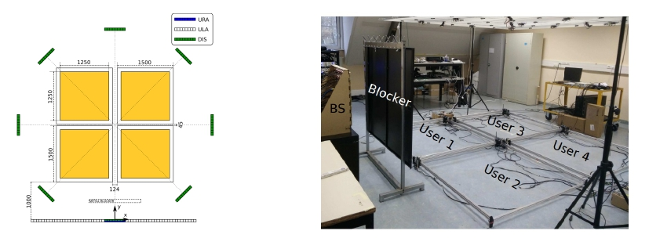

# Self-Supervised and Invariant Wireless Channel Representations

This repository comprises of the necessary code to reproduce results in the paper [Self-Supervised and Invariant Representations for Wireless Localization](TBC) that has been submitted for review. The results from Table III in the paper can be replicated with minimal or no modifications to the provided scripts.

**Note:**  It is possible to achieve significantly greater accuracy than what we report in Table III for our models (See [results](./results/README.md)). See Colab notebook for a [demonstration](https://drive.google.com/file/d/1BHFtmGYVj2VWEXTKWjAVp502mIyuBiTr/view?usp=sharing).

### System Model
An illustration of the system model for co-located massive MIMO is shown below.

<p align="center">
  
</p>

### Cite
```
@JOURNAL{TBC,
    author={Salihu, Artan and Schwarz, Stefan and Rupp, Markus},
    booktitle={TBC}, 
    title={Self-Supervised and Invariant Representations for Wireless Localization}, 
    year={2023},
    pages={-},
    doi={-}
}
```

## Setup
Dependencies: 
- python (>=3.7)
- Torch: 1.10.0+cu111
- Check other imported libraries (or use Colab).

## Models
The weights for different trained models can be accessed by downloading from the table below. The example provided contains the weights for the model trained on the KUL-NLOS dataset, and with the complete set of channel transformations.
| Model | Download | 
|------------------------|-------------------------------|
| 10800_w_aug_iterations |  [Download from owncloud](https://owncloud.tuwien.ac.at/index.php/s/3dvqqD2WZkA5bSV/download) | 
| 05400_w_aug_iterations |  [Download from owncloud](https://owncloud.tuwien.ac.at/index.php/s/bQZ1HrZmBisfaEa/download) |

#### Datasets
Two sample sets from the KUL-LAB-NLOS dataset are provided to test the codes and replicate the results. Alternatively, download the complete dataset `ultradense_dataset ` from [IEEE data port](https://ieee-dataport.org/open-access/ultra-dense-indoor-mamimo-csi-dataset). To process the dataset, use the commented code in the `tester_classifier.py` script starting from line 132.

- A sample set with approximately $\mathbf{9\,000}$ samples. Download channel samples from [kuluwen_URA_lab_nLoS_CSI_9k](https://owncloud.tuwien.ac.at/index.php/s/JymbpaW4aKwP5nG/download) and labels from [kuluwen_URA_lab_nLoS_LOC_9k](https://owncloud.tuwien.ac.at/index.php/s/JymbpaW4aKwP5nG/download). Set these vales in `config.json` for the keys `sub_dataset_to_use` and `sub_loc_dataset_to_use`. Place the datasets in a subfolder and set the name of subfolder in `config.json` for the key `saved_dataset_path`.
- A sample set with approximately $\mathbf{28\,000}$ samples. Download channel samples from [kuluwen_URA_lab_nLoS_CSI_28k](https://owncloud.tuwien.ac.at/index.php/s/JymbpaW4aKwP5nG/download) and labels from [kuluwen_URA_lab_nLoS_LOC_28k](https://owncloud.tuwien.ac.at/index.php/s/JymbpaW4aKwP5nG/download). Set these vales in `config.json` for the keys `sub_dataset_to_use` and `sub_loc_dataset_to_use`. Place the datasets in a subfolder and set the name of subfolder in `config.json` for the key `saved_dataset_path`.
- Same processing steps for KUL-LOS-ULA and KUL-LOS-DIS.

<p align="center"></p>

#### S and HB datasets
Two different :train2: scenarios are modelled for the S and HB datasets. 

<p align="center"></p>

- Download dataset for [S-Scenario](https://owncloud.tuwien.ac.at/index.php/s/JymbpaW4aKwP5nG/download). S-200 dataset details [⏭️](https://mcg-deep-wrt.netlify.app/deep-wrt/s-scenario/).
- Download dataset for [HB-Scenario](https://owncloud.tuwien.ac.at/index.php/s/bkPRLaa3y3t4pjj/download). HB-200 dataset details [⏭️](https://mcg-deep-wrt.netlify.app/deep-wrt/hb-scenario/).

#### Other datasets
- The **wild-v2** dataset is obtained from the 'supposed to happen' [competition](https://www.kaggle.com/competitions/wild-v2/overview).

#### Linear Location Esitmation 
| Iterations_model (data regime) | ↓ MAE [mm] | ↓ 95-th percentile [mm] |
|--------------------------------|------------|-------------------------|
| 05400_w_aug_iterations (1k) |  461.039 | 916.478 | 
| 05400_w_aug_iterations (5k) |  402.631 | 810.78 | 
| 05400_w_aug_iterations (10k) |  395.424 | 791.735 |

#### Spot Estimation
| Model (data regime)           | ↑ Top-1 |
|-------------------------------|-------|
| Random (2.3k)                 | 24.98 |
| 05400_w_aug_iterations (2.3k) | 96.84 |

#### Fine-tuner for Location Estimation

| Iterations_model (data regime) | ↓ MAE [mm] | ↓ 95-th percentile [mm] |
|--------------------------------|------------|-------------------------|
| 05400_w_aug_iterations (1k) |  280.531 | 640.626 |
| 05400_w_aug_iterations (5k) |  130.325 | 309.206 |
| 05400_w_aug_iterations (10k) |  81.8767 | 182.098 |

#### Fully-Supervisor for Location Estimation
| Iterations_model (data regime) | ↓ MAE [mm] | ↓ 95-th percentile [mm] |
|--------------------------------|-------------|------------------------|
| 05400_w_aug_iterations (1k) |  345.489 | 747.552 |
| 05400_w_aug_iterations (5k) |  158.137 | 373.993 |
| 05400_w_aug_iterations (10k) |  92.8073 | 210.09 |

#### 

#### Acknowledgement
References [[26]](https://ieeexplore.ieee.org/document/9709990), [[30]](https://arxiv.org/pdf/2106.09785.pdf),[[31]](https://ieeexplore.ieee.org/document/9878641), and [[timm]](https://github.com/rwightman/pytorch-image-models/tree/main/timm).


#### Transfer Learning to Path-Loss Estimation
| Method  | ↓ MAE      | ↓ 95-th           |
| ------- | ----------|------------------ |
| Fully-Supervised             | 5.917     | 18.493           |
| Transfer-learning (Linear)  | 16.08     | 31.682           |
| SWiT+Linear                  | 6.594     | 18.426           |


#### Other Works


|               Other Works       |   |  
|---------------------------------|---|
| [RRH Selection](https://ieeexplore.ieee.org/document/9815773) | <p align="center"></p> |
| [Uncertainty Wireless Loc](https://ieeexplore.ieee.org/document/9616218)        | <p align="center"></p> |
| Channel Subspace                | <p align="center"></p>|
| [Low-dimensional Representations](https://ieeexplore.ieee.org/document/9253408)        | <p align="center"></p>  |
